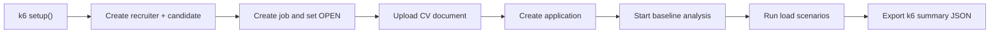

# SmartHireAI k6 Performance Tests

This folder contains a reproducible k6-based load test flow for the SmartHireAI API layer.
It is designed to satisfy the course requirement for API load and breaking tests plus written reporting.

## What this covers

- Automated test-data seeding in `setup()`
- Login and token validation load
- Recruiter job list and job detail reads
- Application list and detail reads
- AI analysis report reads
- Repeated AI analysis start requests under controlled load
- Threshold-based pass/fail evaluation
- JSON summary export for reporting

## Test scripts

### 1. Baseline happy-path test

- Script path: `performance/k6/smarthire-load-test.js`
- Result export: `performance/results/k6-summary.json`
- Purpose: controlled load, low-noise benchmark, fast verification

### 2. Realistic mixed-load test

- Script path: `performance/k6/smarthire-realistic-load-test.js`
- Result export: `performance/results/k6-realistic-summary.json`
- Purpose: more realistic concurrency, repeated reads/writes, duplicate apply attempts, and business-rule contention

## Seeded data created by the script

The `setup()` stage automatically creates:

1. One recruiter user
2. One candidate user
3. One job posting
4. One uploaded candidate CV
5. One application linked to that job
6. One baseline AI analysis report

This means the test can run without manual database preparation, as long as the services are already up.

## Prerequisites

The following services must be running before the test starts:

1. `auth-service`
2. `document-service`
3. `job-service`
4. `application-service`
5. `ai-analysis-service`
6. `dispatcher-service`

Recommended startup path:

```powershell
docker compose up -d postgres mongo redis
```

Then run the Java services locally or use the full compose stack if available.

## How to run

### Option 1 - Local k6 installation

If `k6` is installed locally:

```powershell
k6 run .\performance\k6\smarthire-load-test.js --env BASE_URL=http://localhost:8080
```

### Option 2 - Dockerized k6

If local `k6` is not installed, run k6 via Docker Desktop:

```powershell
docker run --rm -i `
  -v "${PWD}:/workspace" `
  -w /workspace `
  grafana/k6 run /workspace/performance/k6/smarthire-load-test.js `
  --env BASE_URL=http://host.docker.internal:8080
```

### Realistic mixed-load run

```powershell
docker run --rm -i `
  -v "${PWD}:/workspace" `
  -w /workspace `
  grafana/k6 run /workspace/performance/k6/smarthire-realistic-load-test.js `
  --env BASE_URL=http://host.docker.internal:8080
```

## Tunable environment variables

These are optional:

```text
BASE_URL=http://localhost:8080
RAMP_UP=10s
STEADY=30s
RAMP_DOWN=10s
ANALYSIS_RATE=2
THINK_TIME=1
```

Example:

```powershell
k6 run .\performance\k6\smarthire-load-test.js `
  --env BASE_URL=http://localhost:8080 `
  --env STEADY=60s `
  --env ANALYSIS_RATE=3
```

## Included scenarios

### 1. Auth Login

- Repeated login requests
- Token validation requests
- Measures authentication endpoint responsiveness

### 2. Recruiter Reads

- `GET /api/jobs`
- `GET /api/jobs/recruiter/{id}`
- `GET /api/jobs/{id}`

### 3. Application Reads

- `GET /api/applications/job/{jobId}`
- `GET /api/applications/candidate/{candidateId}`
- `GET /api/applications/{id}`

### 4. Analysis Report

- `GET /api/analysis/report/{jobId}`
- `GET /api/analysis/{analysisId}/candidates`

### 5. Analysis Start

- `POST /api/analysis/start`
- This is the heavier scenario because it exercises the full analysis pipeline repeatedly

## Why the baseline script may show 0% error

That result is possible and not automatically suspicious because the baseline script:

- runs in a clean local environment
- seeds valid data automatically
- mostly exercises happy-path flows
- does not intentionally create much business-rule contention
- uses the heuristic analysis engine instead of an unstable external dependency

This makes it useful as a benchmark, but not sufficient on its own as a “real-life” test story.

## What the realistic script adds

The realistic script is closer to actual usage because it:

- creates multiple candidates and multiple jobs
- mixes recruiter reads, candidate reads, writes, and analysis traffic
- includes repeated application attempts to the same jobs
- treats expected `409 Conflict` and `400 Bad Request` business responses separately from actual system failures
- tracks custom metrics:
  - `business_conflicts`
  - `business_validation_failures`
  - `unexpected_errors`
  - `successful_writes`

This distinction matters:

- `409` duplicate application is usually a valid business outcome, not a broken system
- `500`, timeout, or connection failure is an actual reliability problem

## Thresholds

The script currently marks the run as failed if:

- overall failed request rate is `>= 5%`
- check success rate is `<= 95%`
- scenario p95 latency exceeds the defined limit

Current p95 limits:

- auth login: `< 800 ms`
- recruiter reads: `< 900 ms`
- application reads: `< 900 ms`
- analysis report: `< 1200 ms`
- analysis start: `< 2000 ms`

These values are suitable for a course/demo environment and can be tightened later.

## Reporting guidance

After each run:

1. Keep the console summary
2. Save `performance/results/k6-summary.json`
3. Add the observed metrics into your final project report
4. Explain which endpoints were tested and under what load
5. Comment on bottlenecks, errors, and p95 latency

## Suggested report table

Use a table like this in your project documentation:

| Scenario | Users/Rate | Duration | Avg Latency | p95 Latency | Error Rate | Result |
| --- | --- | --- | --- | --- | --- | --- |
| Auth Login | 20 VU | 30s | ... | ... | ... | Pass/Fail |
| Recruiter Reads | 12 VU | 30s | ... | ... | ... | Pass/Fail |
| Application Reads | 10 VU | 30s | ... | ... | ... | Pass/Fail |
| Analysis Report | 8 VU | 30s | ... | ... | ... | Pass/Fail |
| Analysis Start | 2 req/s | 30s | ... | ... | ... | Pass/Fail |

## Mermaid flow



## Notes

- The current backend login token is a simplified implementation for development, but that does not block load testing.
- The AI analysis service in Docker compose is configured with `ANALYSIS_ENGINE=heuristic`, which is appropriate for repeatable local performance tests.
- If Docker Desktop is not accessible on the machine, run the script after installing local k6.
- For submission, include both:
  - one baseline run for clean benchmark numbers
  - one realistic mixed-load run for credibility and interpretation
